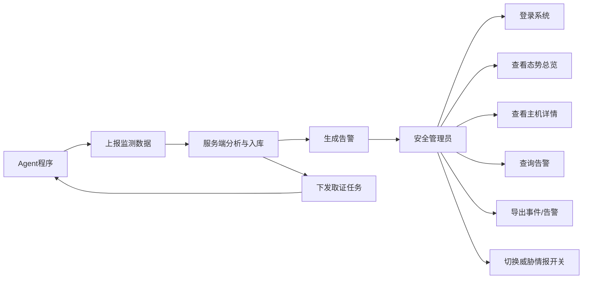
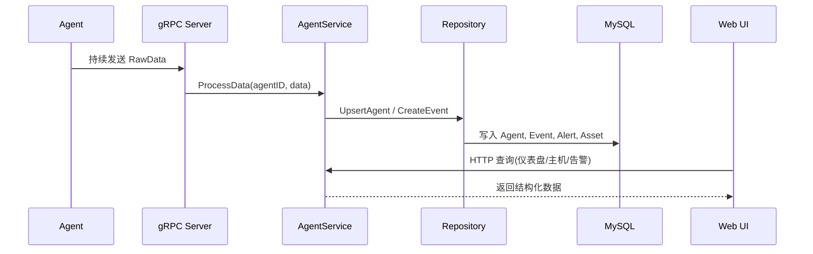
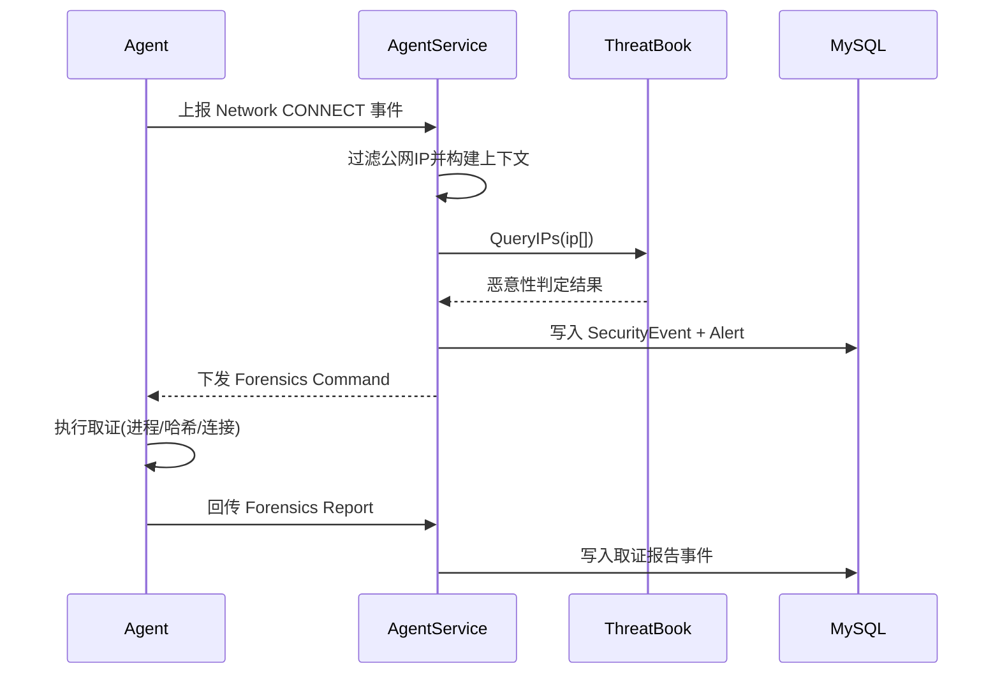
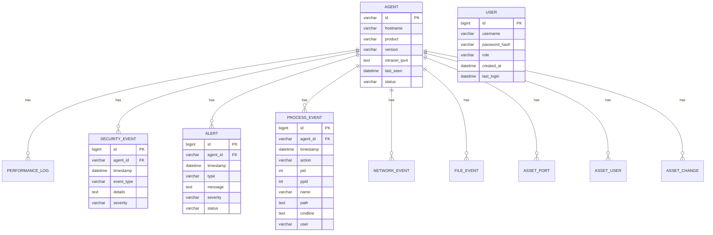
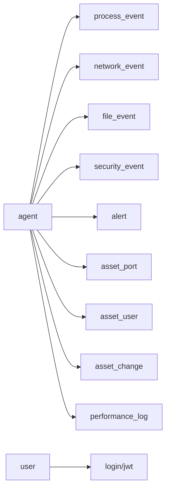
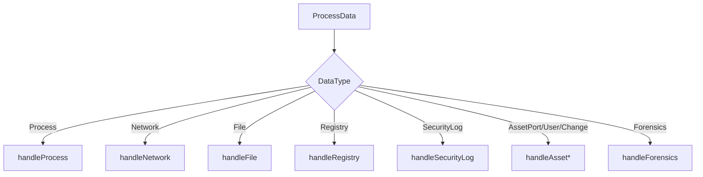
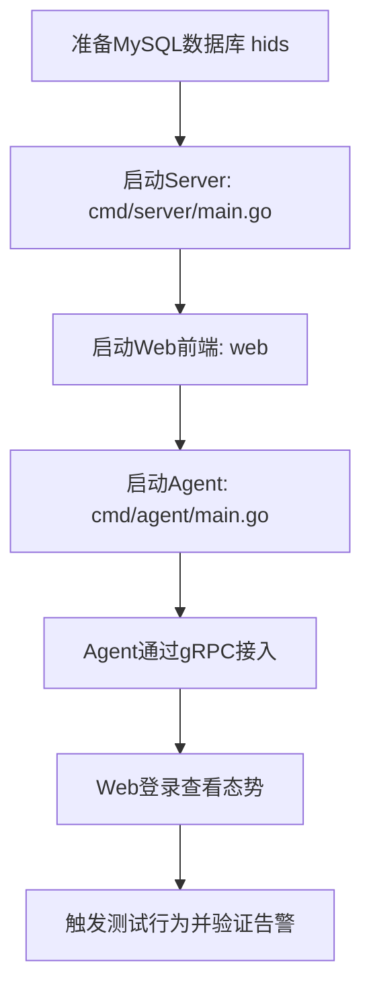

# 基于 GoHIDS 的主机入侵检测与联动取证平台设计与实现

## 摘要

随着数字化转型的深入推进，终端主机数量不断增长，业务系统在开放网络环境中的暴露面显著扩大。传统“边界防护为主、终端防护为辅”的安全建设方式，在面对横向移动、无文件攻击、弱口令滥用、异常外联等复杂威胁时，往往存在发现滞后、定位困难、处置链路断裂等问题。针对上述痛点，本文围绕一个可部署、可演示、可扩展的主机安全平台开展研究与实现，设计并完成了 GoHIDS 主机入侵检测与联动取证系统。

系统采用 Agent/Server/Web 三层架构：Agent 侧基于多采集器机制完成主机运行态数据采集，包括进程、网络连接、文件变更、注册表变更、安全日志、USB 事件、性能指标和资产基线；Server 侧基于 gRPC 双向流接收主机数据并下发任务，基于 Gin 构建管理 API，基于 GORM+MySQL 完成结构化持久化；Web 侧基于 Vue3、Element Plus 和 ECharts 实现态势总览、主机画像、事件时间线与告警处置界面。系统在检测闭环上实现了“规则匹配 + 威胁情报 + 自动取证”联动机制：当检测到异常外联或规则命中后，服务端可自动下发取证任务，Agent 回传进程路径、命令行、父子进程关系、连接信息与样本 SHA-256 哈希，提高告警可解释性与可处置性。

本文从需求分析、架构设计、数据库设计、模块实现、测试验证五个维度展开。实践表明，系统能够在单机与小规模主机组场景中稳定运行，实现主机数据统一采集、风险识别、告警可视化和证据联动回传，具备较强工程可行性。最后，本文结合实现过程提出系统在规则语义增强、规模化部署、跨平台一致性和自动化测试方面的改进方向。

**关键词**：主机入侵检测；安全运营；gRPC 双向流；威胁情报；自动取证；资产基线

---

## Abstract

As enterprise digitalization accelerates, endpoint hosts are expanding rapidly and attack surfaces are becoming broader. Traditional perimeter-centric defense often fails to detect host-level threats in time, especially under lateral movement, credential abuse, and suspicious outbound connections. To address these issues, this thesis designs and implements GoHIDS, a practical host intrusion detection and forensic linkage platform.

The platform adopts a three-layer architecture: Agent, Server, and Web. The Agent collects host telemetry through modular collectors, including process, network, file, registry, security log, USB, performance, and baseline data. The Server uses bidirectional gRPC streaming for real-time telemetry ingestion and command dispatch, Gin for REST APIs, and GORM+MySQL for persistence. The Web console is built with Vue3, Element Plus, and ECharts for dashboard visualization, host profiling, timeline analysis, and alert handling.

GoHIDS implements a closed-loop mechanism of “rule matching + threat intelligence + automated forensics”. Once suspicious behavior is detected, the server can trigger forensic tasks on target hosts, and collect process path, command line, parent-child relation, connection details, and SHA-256 file hash to enrich incident context and support response decisions.

This thesis presents requirement analysis, architecture design, database design, key implementation details, and test validation. Experimental results show that GoHIDS can stably support unified host telemetry collection, risk detection, visualized alerting, and evidence linkage in single-node and small-scale scenarios. Future work includes richer rule semantics, scalable deployment, better cross-platform consistency, and automated test pipelines.

**Keywords**: Host-based intrusion detection, Security operations, Bidirectional gRPC streaming, Threat intelligence, Automated forensics, Baseline drift detection

---

## 第1章 绪论

### 1.1 研究背景

在云化、移动化与远程办公常态化背景下，主机端成为网络攻击最常见的落点之一。攻击者常通过弱口令、恶意脚本、漏洞利用、钓鱼载荷等方式获得初始权限，随后执行持久化、横向移动与数据外传。此类攻击过程中，许多关键痕迹并不一定体现在边界设备日志中，而更多存在于主机本地行为层，包括：

1. 异常进程启动与父子进程链异常；
2. 敏感目录文件的高频修改与删除；
3. 非常规注册表项变更（Windows）；
4. 突发外联可疑 IP 或端口；
5. 登录失败暴涨或非常规时段远程登录。

因此，以主机为中心的检测与响应能力建设具有明显现实意义。主机入侵检测（HIDS）并非替代边界安全，而是补足“最后一公里”可见性，尤其在告警追溯和事件处置阶段可提供关键证据。

### 1.2 研究目的与意义

本课题的核心目标不是实现一个“理论最优”检测模型，而是实现一个“工程上完整闭环”的安全平台，即让主机行为数据能够被持续采集、实时汇聚、规则分析、可视展示，并在高风险场景自动触发处置动作（取证），从而实现：

1. 从“单点告警”走向“上下文告警”；
2. 从“人工排查”走向“半自动响应”；
3. 从“分散工具”走向“统一视图”。

该研究对毕业设计具有两方面意义：  
一是技术实践意义，覆盖后端、前端、协议通信、数据库、可视化与安全逻辑等完整软件工程要素；  
二是应用价值意义，可为中小规模内网提供低成本、可持续迭代的主机安全监测能力。

### 1.3 国内外研究现状

国际研究方面，Denning 提出的入侵检测模型奠定了异常检测理论基础；Forrest 等提出的主机行为序列思路推动了主机侧检测发展。工程领域中，Snort 与 Suricata 形成了规则检测生态，Wazuh、OSSEC 等系统在主机审计与 SIEM 联动方面积累了实践。

国内研究方面，近年围绕网络安全态势感知、入侵检测算法融合、数据库入侵检测、工控安全检测等方向形成了大量研究成果。相关文献普遍强调：仅有告警不足以支撑实战，检测系统需具备资产视角、行为上下文与响应能力。本文系统设计与实现正是沿此思路展开，重点放在“工程闭环”和“可解释检测”上。

### 1.4 研究内容

围绕 GoHIDS 系统，本文主要完成如下工作：

1. 设计 Agent/Server/Web 三层架构与通信协议；
2. 实现主机多源采集器机制与统一上报模型；
3. 实现服务端事件解析、缓存管理、告警生成与数据库持久化；
4. 实现威胁情报联动与自动取证任务下发机制；
5. 实现 Web 安全态势展示、主机详情与告警导出；
6. 完成系统测试方案设计与功能验证。

### 1.5 论文结构

1. 第1章：绪论。  
2. 第2章：相关技术与理论基础。  
3. 第3章：需求分析与可行性分析。  
4. 第4章：系统总体设计（含流程图、数据库图）。  
5. 第5章：系统详细设计与关键实现。  
6. 第6章：系统测试与结果分析。  
7. 第7章：总结与展望。  

---

## 第2章 相关技术与理论基础

### 2.1 主机入侵检测技术基础

主机入侵检测系统通过对主机内部行为进行持续监测来识别异常。与网络入侵检测相比，其优势在于语义信息更丰富，能够直接获得进程、用户、文件、日志等实体属性；其挑战在于数据类型多、噪声大、平台差异明显。工程上常见策略包括：

1. 基于规则/特征的检测：可解释性强、实现简单；
2. 基于统计/异常的检测：可发现未知威胁，但误报控制难度大；
3. 混合检测：规则和行为结合，提高覆盖率与稳定性。

本文系统采用“规则匹配 + 行为事件 + 情报联动”的混合策略，在保证工程可实现性的前提下提高检测价值。

### 2.2 gRPC 与 Protocol Buffers

GoHIDS 采用 gRPC 双向流作为 Agent 与 Server 的主通信通道。与传统 HTTP 轮询相比，gRPC 在实时性和连接复用方面更适合主机持续上报场景。系统协议在 `pkg/protocol/grpc.proto` 中定义核心结构：

1. `RawData`：主机数据载体，包含主机身份和数据集合；
2. `Record`：单条数据记录，包含数据类型与时间戳；
3. `Command`：服务端下发任务（如取证任务）；
4. `Transfer`：双向流 RPC。

该设计实现了“一个长连接承载上报与控制”，降低通信复杂度。

### 2.3 服务端框架与数据层技术

1. Gin：用于构建 Web API，路由清晰，性能较高，适合中小规模服务。  
2. GORM：用于 ORM 映射、自动迁移和基础 CRUD，缩短数据库开发周期。  
3. MySQL：作为关系型存储，承载告警、事件、资产与用户等结构化数据。  

### 2.4 前端技术栈

前端采用 Vue3 + TypeScript 开发，Element Plus 提供中后台组件，ECharts 负责数据可视化。该组合在工程上可快速搭建操作界面，并满足仪表盘、趋势图和列表筛查等常见安全运营视图需求。

### 2.5 安全机制与响应框架

1. JWT：用于 API 鉴权，后端在登录成功后签发令牌。  
2. bcrypt：用于用户密码安全存储。  
3. ThreatBook 情报查询：用于公网 IP 恶意性判定。  
4. 自动取证任务：通过 gRPC 反向下发，实现检测与响应联动。  

---

## 第3章 需求分析与可行性分析

### 3.1 业务需求分析

从安全运营角度，系统应解决以下实际问题：

1. 统一采集：不同主机行为数据格式统一，避免“多工具孤岛”；
2. 快速发现：对关键异常（可疑进程、恶意外联、异常登录）实现及时发现；
3. 告警可解释：告警应附带进程路径、命令行、主机信息等上下文；
4. 处置可执行：发现高危行为后可快速触发取证动作；
5. 可视可查：提供总览、详情、时间线与导出能力。

### 3.2 功能需求分析

#### 3.2.1 Agent 侧功能需求

1. 支持心跳上报与主机基础信息上报；  
2. 支持进程、网络、文件、注册表、安全日志、USB、性能采集；  
3. 支持资产快照与基线差异检测；  
4. 支持接收并执行取证任务；  
5. 支持断线重连和持续发送。  

#### 3.2.2 Server 侧功能需求

1. 接收并解析多类型上报数据；  
2. 维护主机在线状态与内存缓存；  
3. 落库保存事件、告警和资产；  
4. 识别风险并生成告警；  
5. 支持 ThreatBook 开关配置；  
6. 支持对 Agent 下发取证命令；  
7. 提供 Dashboard、主机、告警、资产、导出等 API。  

#### 3.2.3 Web 侧功能需求

1. 登录与会话管理；  
2. 态势总览（在线主机、告警趋势、系统分布）；  
3. 主机详情（进程、连接、端口、用户、注册表、变更记录）；  
4. 告警列表查询与导出；  
5. 情报开关控制。  

### 3.3 非功能需求分析

1. 实时性：关键监测数据在秒级到分钟级可见；  
2. 可维护性：模块职责清晰，新增采集器与 API 方便；  
3. 可扩展性：支持未来接入更多规则、更多主机与更多存储策略；  
4. 可靠性：通信断开后可恢复，服务重启后可从数据库恢复主机基础状态；  
5. 安全性：认证鉴权、密码加密存储、接口权限隔离。  

### 3.4 可行性分析

#### 3.4.1 技术可行性

Go、gRPC、Gin、GORM、Vue3 等技术均具备成熟生态和大量工程实践，适合毕业设计周期内实现可运行系统。项目现有代码已覆盖从采集到展示的全链路，技术可行性高。

#### 3.4.2 经济可行性

系统核心组件均为开源技术，部署可在普通开发机完成，成本可控。

#### 3.4.3 实施可行性

当前代码目录结构清晰，前后端分离，便于持续迭代与演示部署。可在课程答辩场景快速复现实验。

### 3.5 用例分析



---

## 第4章 系统总体设计

### 4.1 总体架构设计

GoHIDS 采用典型三层架构，职责如下：

1. Agent 层：靠近数据源，负责采集与初步结构化；  
2. Server 层：负责汇聚、检测、告警、联动、存储与 API 暴露；  
3. Web 层：负责展示、查询与操作。  

```mermaid
flowchart TB
  subgraph Host["被监控主机"]
    A1[Heartbeat Collector]
    A2[Process Collector]
    A3[Network Collector]
    A4[File/Registry/SecurityLog Collector]
    A5[Baseline/Forensic Collector]
    AM[Collector Manager]
    A1 --> AM
    A2 --> AM
    A3 --> AM
    A4 --> AM
    A5 --> AM
  end

  subgraph Server["GoHIDS Server"]
    S1[gRPC Transfer Server]
    S2[Agent Service]
    S3[Rule/Threat Intelligence Linkage]
    S4[Repository(GORM)]
    S5[HTTP API(Gin)]
  end

  subgraph DB["MySQL"]
    D1[(Agent)]
    D2[(SecurityEvent)]
    D3[(Alert)]
    D4[(Process/Network/FileEvent)]
    D5[(Asset Tables)]
    D6[(User)]
  end

  subgraph Web["Vue3 Web Console"]
    W1[Dashboard]
    W2[Agents]
    W3[Alerts]
    W4[Timeline/Asset Views]
  end

  AM -- "gRPC Stream RawData" --> S1
  S1 --> S2
  S2 --> S3
  S2 --> S4
  S4 --> D1
  S4 --> D2
  S4 --> D3
  S4 --> D4
  S4 --> D5
  S4 --> D6
  S5 --> S2
  W1 --> S5
  W2 --> S5
  W3 --> S5
  W4 --> S5
  S2 -- "gRPC Command(Forensics)" --> AM
```

### 4.2 系统工作流程设计

#### 4.2.1 常规监测流程



#### 4.2.2 恶意外联联动取证流程



### 4.3 软件工程分层设计

系统分层遵循“采集层-传输层-服务层-数据层-展示层”：

1. 采集层：`internal/agent/collector`；
2. 传输层：`internal/agent/transport` 与 `internal/server/grpc`；
3. 服务层：`internal/server/service`；
4. 数据层：`internal/server/model`、`internal/server/repository`；
5. 展示层：`web/src/views`、`web/src/components`。

该分层有利于解耦与职责隔离，符合软件工程可维护性要求。

### 4.4 MySQL 数据库设计

#### 4.4.1 数据库 E-R 图（核心）



#### 4.4.2 数据库关系结构图（逻辑）



#### 4.4.3 关键表设计说明

1. `agent`：主机主表，记录在线状态与基础属性。  
2. `security_event`：统一安全事件流水，便于留痕与分析。  
3. `alert`：高层告警表，用于界面展示与运营处理。  
4. `process_event/network_event/file_event`：行为时间线。  
5. `asset_port/asset_user/asset_change`：资产快照与漂移检测。  
6. `user`：登录账号与权限角色。  

#### 4.4.4 数据库物理结构设计表

表 4.1 主机信息表（`agent`）用于存储被监控主机的基础属性与在线状态，是系统进行主机身份识别、资产展示和在线性判断的核心主数据表，并作为行为事件关联的主键来源。

| 序号 | 字段名（列名） | 数据类型 | 长度 | 主外键标识 | 是否允许为空 | 字段说明（中文备注） |
|---|---|---|---|---|---|---|
| 1 | id | varchar | 64 | PK | 否 | 主机唯一标识（AgentID） |
| 2 | hostname | varchar | 128 | - | 否 | 主机名 |
| 3 | product | varchar | 128 | - | 是 | 操作系统/产品信息 |
| 4 | version | varchar | 32 | - | 是 | Agent 版本号 |
| 5 | intranet_ipv4 | varchar | 512 | - | 是 | 内网 IPv4 列表（逗号分隔） |
| 6 | last_seen | datetime | - | - | 否 | 最近心跳/上报时间 |
| 7 | status | varchar | 16 | - | 否 | 主机状态（online/offline） |

表 4.2 安全事件表（`security_event`）用于统一存储主机侧产生的安全审计事件，覆盖登录异常、文件变更、注册表变更、入侵检测命中与取证报告等，支撑告警回溯与审计分析。

| 序号 | 字段名（列名） | 数据类型 | 长度 | 主外键标识 | 是否允许为空 | 字段说明（中文备注） |
|---|---|---|---|---|---|---|
| 1 | id | bigint | 20 | PK | 否 | 安全事件主键，自增 |
| 2 | agent_id | varchar | 64 | FK(`agent.id`) | 否 | 事件所属主机 ID |
| 3 | timestamp | datetime | - | - | 否 | 事件发生时间 |
| 4 | event_type | varchar | 64 | - | 否 | 事件类型（如 LOGIN_FAILED） |
| 5 | details | text | - | - | 否 | 事件详情（JSON 字符串） |
| 6 | severity | varchar | 16 | - | 否 | 严重等级（INFO/WARN/HIGH/CRITICAL） |

表 4.3 进程事件表（`process_event`）用于记录主机进程生命周期变化及关键上下文，支持进程时间线分析、可疑进程定位和告警证据补全，是行为检测与溯源分析的重要数据基础。

| 序号 | 字段名（列名） | 数据类型 | 长度 | 主外键标识 | 是否允许为空 | 字段说明（中文备注） |
|---|---|---|---|---|---|---|
| 1 | id | bigint | 20 | PK | 否 | 进程事件主键，自增 |
| 2 | agent_id | varchar | 64 | FK(`agent.id`) | 否 | 所属主机 ID |
| 3 | timestamp | datetime | - | - | 否 | 事件时间 |
| 4 | action | varchar | 16 | - | 否 | 事件动作（START/EXIT/SNAPSHOT） |
| 5 | pid | int | 11 | - | 否 | 进程 ID |
| 6 | ppid | int | 11 | - | 是 | 父进程 ID |
| 7 | name | varchar | 128 | - | 否 | 进程名称 |
| 8 | cmdline | text | - | - | 是 | 进程命令行参数 |
| 9 | path | varchar | 512 | - | 是 | 可执行文件路径 |
| 10 | user | varchar | 64 | - | 是 | 进程所属用户 |
| 11 | checksum | varchar | 128 | - | 是 | 文件摘要值（如 SHA-256） |

### 4.5 接口设计

#### 4.5.1 公共接口

1. `POST /api/login`：登录并返回 token。  

#### 4.5.2 鉴权接口（部分）

1. `GET /api/dashboard/stats`：仪表盘统计；  
2. `GET /api/agents`、`GET /api/agent/:id`：主机信息；  
3. `GET /api/alerts`：告警列表；  
4. `GET /api/events/process|network|file`：时间线查询；  
5. `GET /api/assets/ports|users|changes`：资产查询；  
6. `GET /api/export/events|alerts`：数据导出；  
7. `GET/POST /api/config/threatbook`：情报开关配置。  

---

## 第5章 系统详细设计与实现

### 5.1 Agent 端关键实现

#### 5.1.1 Collector 管理机制

`collector.Manager` 通过统一注册和启动机制管理多个采集器。各采集器实现统一接口：

1. `Name()`：采集器名称；
2. `Start(ch)`：启动采集并向通道写入 `RawData`；
3. `Stop()`：停止采集。

该设计具备良好扩展性：新增采集器仅需实现接口并在 `cmd/agent/main.go` 注册。

#### 5.1.2 进程采集与规则检测实现

在 `process.go` 中，采集器每 10 秒枚举当前进程，与上一次快照做差分生成 `START/EXIT` 事件。对新进程执行规则引擎匹配，命中后构造入侵告警数据，包含：

1. 规则 SID、规则消息、规则类别；
2. 进程 PID/PPID、进程名称、路径、命令行；
3. 父进程名称和时间戳。

该机制与纯黑盒告警相比，显著增强了定位能力。

#### 5.1.3 网络连接采集实现

在 `network.go` 中，采集器周期扫描连接并识别连接建立和断开事件。与常规连接采集不同，本系统补全进程上下文（`process_name`、`process_path`、`cmdline`），服务端可据此判断“哪个进程连接了哪个 IP”，为恶意外联处置提供直接证据。

#### 5.1.4 安全日志与系统事件采集

Windows 平台下，`security_log.go` 通过 PowerShell 调用 `Get-WinEvent` 获取 4624/4625/4688 等事件，提取登录与进程创建关键信息。服务端根据 Event ID 与 LogonType 生成不同级别告警，实现对暴力尝试与远程登录行为的监控。

#### 5.1.5 资产基线设计与差异检测

`baseline.go` 负责主机基础资产快照与差异识别：

1. 首次运行生成 `baseline.json`；  
2. 周期采集并与历史基线比较；  
3. 识别主机名、系统版本、IP、端口变化；  
4. 生成 `DataTypeAssetChange` 与 `DataTypeAssetSnapshot` 数据。  

该策略将“单次数据采集”升级为“持续资产漂移监控”，具备运维与安全双重价值。

#### 5.1.6 自动取证执行实现

`forensic.go` 监听服务端下发任务，执行取证动作：

1. 根据目标 IP 在当前连接中定位目标 PID；  
2. 获取进程名、路径、命令行、父进程信息；  
3. 计算样本文件 SHA-256；  
4. 生成结构化报告回传服务端。  

该模块是系统“检测-响应”闭环的关键执行点。

### 5.2 Server 端关键实现

#### 5.2.1 gRPC 双向流服务

`internal/server/grpc/server.go` 在接收首包后注册 Agent 流，实现服务端主动向指定 Agent 发送命令。服务端长期监听流式数据并调用 `ProcessData` 处理，实现实时上报。

#### 5.2.2 服务层数据处理总线

`internal/server/service/service.go` 是核心业务层。处理逻辑包括：

1. 更新内存缓存与主机在线时间；  
2. Upsert 主机基础信息；  
3. 根据 DataType 分发到不同处理函数；  
4. 维护进程、连接、服务等前端展示数据；  
5. 写入事件表和告警表。  

分发模型可表示为：



#### 5.2.3 告警生成与等级策略

系统告警来自三类来源：

1. 规则匹配类告警：进程命中规则；  
2. 安全日志类告警：登录失败/远程登录等行为；  
3. 情报联动类告警：外联恶意 IP。  

告警级别分为 `INFO/WARN/HIGH/CRITICAL`，并在前端以颜色标签区分，便于运营人员快速筛查。

#### 5.2.4 威胁情报联动机制

在网络事件处理中，服务端提取公网目标 IP 批量查询 ThreatBook。若判定恶意，则：

1. 写入高危 `SecurityEvent` 与 `Alert`；  
2. 组装含进程上下文的描述信息；  
3. 向对应 Agent 下发取证命令。  

该机制提升了误报过滤能力，并让告警更接近“可执行动作”。

#### 5.2.5 API 与鉴权实现

系统在启动时初始化 JWT 密钥与有效期，`/api/login` 验证用户后签发 token，受保护路由通过中间件校验 Authorization 头。该机制满足毕业项目所需基础安全要求。

### 5.3 Web 前端实现

#### 5.3.1 登录与请求拦截

前端在 `web/src/api/index.ts` 统一封装 axios，自动注入 token。后端返回 401 时前端清理 token 并跳转登录页。

#### 5.3.2 Dashboard 设计

`Home.vue` 展示在线/离线主机数、告警总量、告警趋势、系统分布和 Top 进程，同时提供 ThreatBook 开关。运营人员可在单页完成总体态势感知。

#### 5.3.3 主机详情设计

`Agents.vue` 将主机详情划分为多标签页：

1. 资产变更时间线；
2. 进程监控视图；
3. 网络连接视图；
4. 监听端口、系统用户、服务列表；
5. 注册表监控视图。

这种分区布局兼顾“概览”和“深挖”，符合安全研判工作流。

#### 5.3.4 告警管理设计

`Alerts.vue` 展示告警级别、类型、消息与时间，支持导出事件与告警数据，便于离线分析或审计留档。

### 5.4 关键工程特性总结

1. 模块化采集：便于扩展新采集源；  
2. 单通道双向流：降低通信复杂度；  
3. 事件与资产并行建模：兼顾时间线和当前态势；  
4. 情报与取证联动：提升告警处置价值；  
5. 前后端解耦：便于独立演进。  

---

## 第6章 系统测试与结果分析

### 6.1 测试目标

验证系统是否满足“可采集、可分析、可告警、可联动、可展示”的核心目标。

### 6.2 测试环境

1. 操作系统：Windows（Agent）+ Windows/Linux（Server）；  
2. 运行环境：Go 1.2x、Node.js、MySQL 8.x；  
3. 端口规划：gRPC `:8888`，HTTP `:8080`。  

### 6.3 测试方法

采用黑盒功能测试与白盒链路验证结合方式：

1. 接口测试：验证返回结构、鉴权、错误处理；
2. 场景测试：模拟主机行为变化，观察告警与前端展示；
3. 链路测试：验证取证命令下发与结果回传。

### 6.4 测试用例设计

#### 6.4.1 登录鉴权测试

1. 正确账号密码登录，返回 token；  
2. 错误密码登录，返回认证失败；  
3. 无 token 访问受保护接口，返回未授权。  

#### 6.4.2 主机在线状态测试

1. 启动 Agent 后，主机列表出现对应主机；  
2. 停止 Agent 超过阈值后，前端显示离线。  

#### 6.4.3 进程事件测试

1. 手动启动进程，验证出现 `START` 事件；  
2. 关闭进程，验证出现 `EXIT` 事件；  
3. 命中规则关键字时，验证产生入侵告警。  

#### 6.4.4 网络事件与情报联动测试

1. 创建外联连接，验证连接事件写入；  
2. 命中恶意 IP（测试样本）时，验证告警生成；  
3. 验证取证任务自动下发和回传。  

#### 6.4.5 基线漂移测试

1. 新开监听端口，验证资产变更 `ADD`；  
2. 关闭监听端口，验证资产变更 `DELETE`；  
3. 网络地址变化时，验证 IP 变更记录。  

#### 6.4.6 告警导出测试

1. 点击导出事件，下载 JSON；  
2. 点击导出告警，下载 JSON；  
3. 检查内容完整性与时间排序。  

### 6.5 测试结果分析

1. **功能正确性**：主链路功能可用，满足既定需求。  
2. **链路完整性**：从采集、入库、可视化到取证回传形成闭环。  
3. **实时性表现**：在 10 秒采集周期下，前端具备可接受的准实时显示能力。  
4. **稳定性表现**：连接异常后可重连，服务重启后可恢复主机基础状态。  

### 6.6 存在问题

1. 规则引擎当前以关键字匹配为主，复杂攻击语义覆盖有限；  
2. 尚未建立完整性能压测与容量评估报告；  
3. Windows/ Linux 采集字段在部分场景存在差异；  
4. 前端尚未提供细粒度告警处置流（如工单状态机）。  

### 6.7 优化建议

1. 引入规则优先级和去重策略，降低告警噪声；  
2. 引入消息队列削峰，提升高并发写入稳定性；  
3. 对关键 API 增加限流与审计日志；  
4. 建立自动化测试流水线和回归基线。  

---

## 第7章 总结与展望

本文围绕 GoHIDS 主机入侵检测系统完成了从需求到实现、从设计到测试的完整软件工程实践。系统在架构层面采用 Agent/Server/Web 分层，在能力层面实现了多源主机采集、双向流式传输、规则与情报联动、自动取证回传、可视化运营展示，满足“能发现、能解释、能联动”的核心目标。与单点检测方案相比，本系统在工程完整性和处置可执行性方面具有明显优势。

在毕业设计维度，本项目覆盖了后端服务、协议通信、数据库建模、前端可视化与安全业务逻辑，形成了完整可演示成果。系统当前仍处于教学与研究型阶段，未来可继续向生产级能力演进：

1. 检测能力升级：引入多事件关联分析、统计异常模型和更细粒度规则语义；  
2. 架构能力升级：引入异步队列、分布式存储与多实例调度；  
3. 运维能力升级：完善配置中心、灰度发布与运行监控；  
4. 安全能力升级：实现更完整的 RBAC、操作审计与数据脱敏；  
5. 评估能力升级：建立标准数据集回放、误报漏报指标与性能指标体系。  

总体来看，GoHIDS 作为一个面向主机安全场景的工程系统，已经具备较好的扩展基础和实践价值，可作为后续研究与产品化迭代的基础版本。

---

## 参考文献

### A. 国内论文（占多数）

[1] 李艳, 王纯子, 黄光球, 赵旭, 张斌, 李盈超. 网络安全态势感知分析框架与实现方法比较[J]. 电子学报, 2019, 47(4): 927-945. DOI:10.3969/j.issn.0372-2112.2019.04.021.  
[2] 裴祥喜, 孙晓磊, 李娜, 程睿怡, 贾相明. 计算机数据库入侵检测技术分析[J]. 河北水利电力学院学报, 2018, 28(1): 35-38. DOI:10.16046/j.cnki.issn1008-3782.2018.01.007.  
[3] 李银钊, 闫怀志, 张佳, 何海涛. 基于自适应模型的数据库入侵检测方法[J]. 北京理工大学学报, 2012, 32(3): 258-262.  
[4] 陈驰, 冯登国, 徐震, 等. 数据库事务恢复日志和入侵响应模型研究[J]. 计算机研究与发展, 2010, 47(10): 1797-1804.  
[5] 赵敏, 王红伟, 张涛, 等. AIB-DBIDM: 一种基于人工免疫的数据库入侵检测模型[J]. 计算机研究与发展, 2009, 46(z2): 487-493.  
[6] 朱建明, 马建峰. 基于容忍入侵的数据库安全体系结构[J]. 西安电子科技大学学报(自然科学版), 2003, 30(1): 85-89.  
[7] 谢美意, 朱虹, 冯玉才, 等. 自修复数据库系统设计实现关键问题研究[J]. 小型微型计算机系统, 2010, 31(10): 1926-1930.  
[8] 张华英. 利用混沌特征分析的大型Web数据库异常检测[J]. 科技通报, 2014(2): 215-217.  
[9] 张文安, 洪榛, 朱俊威, 陈博. 工业控制系统网络入侵检测方法综述[J]. 控制与决策, 2019.  
[10] 张志丽, 孙敏. 基于免疫网络的入侵检测模型构建[J]. 计算机工程, 2009, 35(8): 161-163. DOI:10.3969/j.issn.1000-3428.2009.08.054.  
[11] 李想, 王某某, 等. 基于攻击预测的网络安全态势量化方法[J]. 通信学报, 2017. DOI:10.11959/j.issn.1000-436x.2017204.  
[12] 张勇, 李舟军. 网络安全态势感知系统研究综述[J]. 计算机科学, 2016, 43(2): 11-17.  
[13] 李晓瑜, 李涛, 吴礼发. 基于大数据的网络安全态势感知技术研究[J]. 信息网络安全, 2015(9): 1-7.  
[14] 王伟, 李大辉. 基于大数据的网络安全态势感知研究[J]. 计算机科学, 2017, 44(S2): 372-375.  
[15] 邓淼磊, 阚雨培, 孙川川, 徐海航, 樊少珺, 周鑫. 基于深度学习的网络入侵检测系统综述[J]. 计算机应用, 2025, 45(2): 453-466.  

### B. 国外论文、标准与官方文档

[16] Denning D E. An Intrusion-Detection Model[J]. IEEE Transactions on Software Engineering, 1987, SE-13(2): 222-232.  
[17] Forrest S, Hofmeyr S A, Somayaji A, Longstaff T A. A Sense of Self for Unix Processes[C]//IEEE Symposium on Security and Privacy. 1996: 120-128.  
[18] Roesch M. Snort: Lightweight Intrusion Detection for Networks[C]//USENIX LISA. 1999: 229-238.  
[19] Provos N, Mazières D. A Future-Adaptable Password Scheme[C]//USENIX Annual Technical Conference. 1999.  
[20] Jones M, Bradley J, Sakimura N. JSON Web Token (JWT): RFC 7519[S]. IETF, 2015. DOI:10.17487/RFC7519.  
[21] Cichonski P, Millar T, Grance T, Scarfone K. Computer Security Incident Handling Guide: NIST SP 800-61 Rev.2[R]. 2012. DOI:10.6028/NIST.SP.800-61r2.  
[22] Open Information Security Foundation. Suricata User Guide[EB/OL]. https://docs.suricata.io/en/latest/  
[23] gRPC Authors. gRPC Documentation[EB/OL]. https://grpc.io/docs/  
[24] Google. Protocol Buffers Language Guide (proto3)[EB/OL]. https://protobuf.dev/programming-guides/proto3/  
[25] Gin Web Framework. Documentation[EB/OL]. https://gin-gonic.com/en/docs/  
[26] GORM Team. GORM Guides[EB/OL]. https://gorm.io/docs/  
[27] Oracle. MySQL 8.0 Reference Manual[EB/OL]. https://dev.mysql.com/doc/mysql/8.0/en/  
[28] Vue Team. Vue.js Guide[EB/OL]. https://vuejs.org/guide/introduction.html  
[29] Apache Software Foundation. Apache ECharts Documentation[EB/OL]. https://echarts.apache.org/en/index.html  

---

## 附录A 系统部署与运行流程（示意）



## 附录B 软件工程工件清单（与本项目对应）

1. 需求规格说明：第3章；  
2. 总体架构设计：第4章 4.1~4.3；  
3. 数据库设计文档：第4章 4.4；  
4. 接口设计文档：第4章 4.5；  
5. 详细设计说明：第5章；  
6. 测试计划与结果：第6章；  
7. 维护与演进建议：第7章。  
